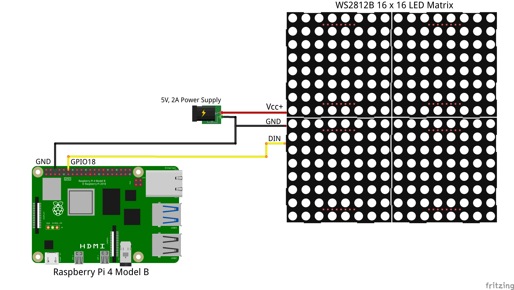

# LED Minecraft Item Frame

## About the Project
The project was created as a part of Louisiana Tech University's Living with Cyber program where, at the end of their first year, freshman computer science students work in teams to build a project over the span of a quarter (Louisiana Tech uses the quarter system rather than the semester system). At the end of the quarter, the teams compete, submitting their projects into a cyber expo competition.
 
 
The LED Minecraft Item Frame won First Place in Louisiana Tech University's Freshman Cyber Expo

### The team
From left to right
- Chris Perry
- Lucas Alvarado
- Sharantz Green
- Cory Strickland

## First Time Setup
**Note: Setup designed for Raspberry Pi**
### App
**Built on Python 3.9.12**

1. [Install VSCode](https://code.visualstudio.com/download)
2. Clone and open the repo
3. Setup and activate a venv virtual environment to use with the repository. 
  [A guide can be found here](https://docs.python.org/3/library/venv.html)
3. Install dependencies in virtual environment
   - [Flask](https://pypi.org/project/Flask/)
   - [flask_cors](https://pypi.org/project/Flask-Cors/) 
   - [adafruit-circuitpython-neopixel](hhttps://pypi.org/project/adafruit-circuitpython-neopixel/)
   - [RPi.GPIO](https://pypi.org/project/RPi.GPIO/)
   - [time](https://pypi.org/project/time/)
   - [unicodedata](https://docs.python.org/3/library/unicodedata.html)
   - [json](https://docs.python.org/3/library/json.html)
   - [os](https://docs.python.org/3/library/os.html)
   - [itertools](https://docs.python.org/3/library/itertools.html)
   - [numpy](https://pypi.org/project/numpy/)

### Circuitry

    

## Running the application
#### Guide to interact with app locally
- **Linux (RPi)**
    1. Assure either:
       1. You have local network access to your RPi
       2. You can port forward your RPi's API service
          I recommend using a service like remote.it for this 
    2. Remote SSH into the Raspberry Pi through VS Code
      [A guide can be found here](https://code.visualstudio.com/docs/remote/ssh)
    3. Use the following launch configuration to run the python app.py file
  
      {
            "name": "Python: Flask",
            "type": "python",
            "request": "launch",
            "module": "flask",
            "env": {
                "FLASK_APP": "${file}",
                "FLASK_DEBUG": "1"
            },
            "args": [
                "run",
                "--no-debugger",
                "--no-reload"
            ],
            "jinja": true,
            "justMyCode": true,
            "sudo": true
        }
    4. Go into [The webpage's JS file](Webpage/app.js) and change the variable "API_URL" to your RPi's either local or port forwarded address including the port if necessary.
      i. Note: The localhost port is already filled in.
    5. Copy the file path to your [index.html](Webpage/index.html) in the repository & paste it into the URL bar in the browser just opened.

## About the App
### Website
- Contains a by default (variable size) 16 x 16 pixel grid with assignable color values
- Left Sidebar:
  - The "Send to Matrix" button uploads the pixels currently in the grid to the 
  - The "Clear Pixel Grid" button sets all of the pixels in the grid to black
  - The "Create/Edit Preset" button:
    - If you have a preset selected or you enter the name of an existing preset, it will update that preset to the values currently in the pixel grid
    - If you enter a preset name that doesn't exist, it will create a new preset with the values currently in the pixel grid
  - The "Upload Image" button:
    - Creates a preset with the preset name specified out of the uploaded image.
    - Must be a PNG
    - Must be a 16x16 image.
- The pixel grid consists of 256 individually addressable pixels using the color picker HTML tag
- Right Sidebar:
  - Retrieves a list of selectable presets from the API host
  - If selected, the preset's pixel values will populate the pixel grid with its values
  - Search bar at the top filters through the list of presets
### API
##### Matrix Program
-The Matrix convert uses the adafruit neopixel library specifically for python
-In order to install the library you must use the command in the terminal 'pip3 install neopixel' and 'pip3 install pillow'
-Afterwards import the board module to initialize the pins on the bread-board
-The global variable is created based on the pin of the data wire and the number of led on the matrix
-There is a hex converter converter function takes RGB values and changes them to hex
- Then the main function runs through a for loop of all the pix values sent through json request parse the string to find the digit
-and turns the RGB to hex and and sends it to the matrix light it up
-The LTU Matrix converter is the program the api sends all of the presets and json request through to light up the board
##### Filesystem Program
- Contains multiple functions that do various tasks with presets and images
  - A function that receives the name of the preset selected from the website, then returns a JSON file containing the pixels and color values
  - A function that sorts through the presets directory and returns a list of all available presets
  - A function that converts hex values to rgb and another that converts rgb to hex
  - A function that takes a dictionary containing a name and pixel values, and creates a preset from them
    - The name received is used to name the JSON file
    - The values received are put into the preset template
    - The path to the image is put into the preset template as well
    - A JSON file is then opened and the newly modified preset is written in it
  - A function that takes in a name and an image, and converts it into a readable dictionary
    - Each pixel is converted into rgb values
    - A dictionary template is set up to take in the name submitted by the user and the values of each pixel
    - A list is created from those rgb values and split into chunks of 16 entries
      - Every other chunk in this list is reversed to match the format of the matrix
    - The list is then converted from rgb values to hex values
    - Those hex values are then appended to one preset template
    - The original list of rgb values is converted then appended to another template in its original order
    - Both templates are returned
  - A function that takes in a preset and uses the pixel values within it to create an image
    - A numpy array is created
    - The pixel values are then assigned to each index in the array and converted from hex to rgb
    - An image is then created using the RGB format
    - The image is then saved in PNG format using the name from the preset
  - A function that does the same thing as the function above but for uploaded images
    - This function uses the unordered pixel values from a converted image
    - The image is created then saved in PNG format
